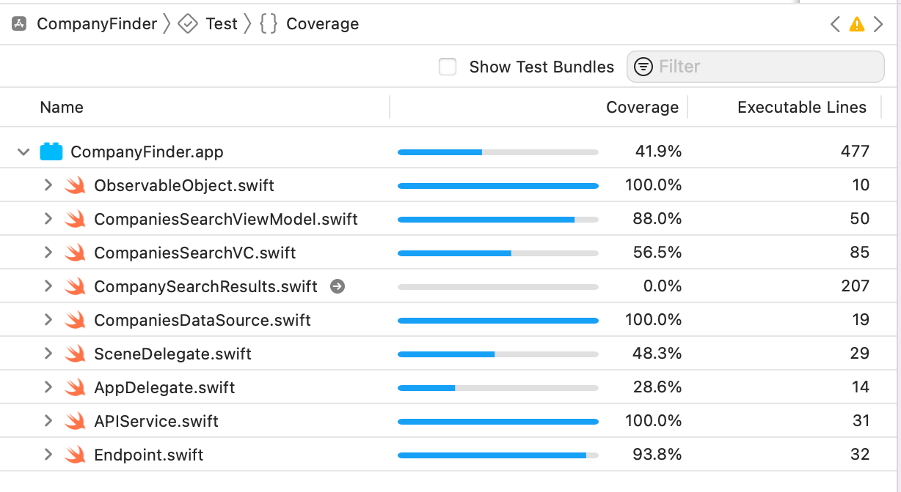

# CompanyFinder
CompanyFinder is a simple iOS app that helps you search for any company registered in the UK. It is a single-screen app with minimal functionality.

# How does it work?
Once the app is launched, you will have a search bar. Just enter something, and it returns the limited companies that are registered in the UK.

## Search Results
By default, the app displays 100 results. The max number of search results a single API can fetch is 100. The default value can be changed in `line 16 of Endpoint.swift file.`

## Info Display
This app also displays a number of results on the current page and total results.

# What does this app demonstrates
This app has minimal functionality, but it demonstrates many things.

## Architecture
The project CompanyFinder uses MVVM architecture. 

## Test Coverage
I've only concentrated on writing Unit Tests as there is minimal UI. This app has code coverage of 41.9%. I know this is very low, but most of the core classes are covered 100%

This well-architectured app achieves maintainability, testability, scalability, and readability.

# Companies House API
The app uses Companies House API to display the list of companies based on the user search. The Companies House API lets you retrieve information about limited companies (and others that fall within the Companies Act 2006). The data returned is live, real-time, and simple to use and understand.

### Search API
When a user enters the search term and clicks search, the following API is called to fetch the data.

#### Request
GET https://api.company-information.service.gov.uk/search/companies

#### Query Paramenter

| Parameter name        | Value           | Description  |
| --------------------- |----------------:| ------------:|
|q                      |string           |The term being searched for|
|items_per_page         |integer          |The number of search results to return per page|
|start_index                    |integer           |The index of the first result item to return.|
|restrictions	|string	|Enumerable options to restrict search results. Space separates multiple restriction options to combine functionality. For a "company name availability" search, use "active-companies legally-equivalent-company-name" together.

#### Authorisation
This request requires an API key in the authorization header.

# Run the App
This app used Cocoapods, so in the first run, ensure you run `pod install` inside the CompanyFinder folder.

## Extended Functionalities

1. Configuration File: When the app grows in size, it will be hard to manage the default values. So it's better to add a configuration file that holds the default list. 
2. Custom Tableview Cell: We can add a custom table view cell to display more information.
3. By adding more comments, we can improve code readability.
